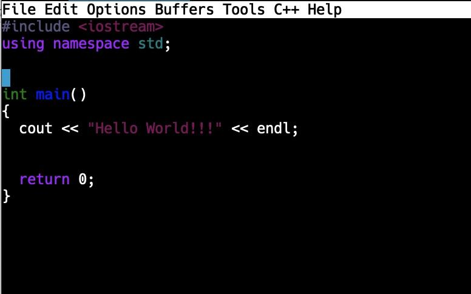

<!-- nav -->
[Table of contents](https://def3qu.github.io/Concise-CPP-Book/) | [Next: Chapter 2 →](02-variables-and-data-types.md)

# Chapter 1 - Introduction to C++

## 1.1 Necessary Background

There is not a lot of background necessary to use this book. Many of you will be coming from a course in Python. That will be helpful, as knowing any programming language makes it easier to learn another. Even without any programming background, you should do fine as long as you know a bit of algebra.

## 1.2 Programming Basics

### 1.2.1 If your program doesn’t work, it is your fault.

This is a bold statement and seems harsh. It is also empowering. A computer program is a series of commands that you want the computer to execute. It will do what you tell it to, and thus if it does not behave as expected, you told it to do something wrong. The empowering part is that you have the power to fix it.

### 1.2.2 Types of Programming Languages

Programming languages fall broadly into two categories: interpreted languages and compiled languages.

An **interpreted language** is one where you store the program code in text form. You load up a program called an interpreter, which then executes each line of your program. Python is an interpreted language. An executable, stand-alone program is never created. To run a Python program, you need to have a Python interpreter installed on your computer.

A **compiled language** is one where you have to run your program code through a program called a **compiler**, which turns your code into an executable program. This is an extra step but produces code that can be distributed on its own. C++ is a compiled language.

## 1.3 Program Development

It is impossible to write a program to solve a problem that you do not know how to solve by hand. Therefore, the first step in writing a program is to understand what problem you are trying to solve, and what some example solutions would look like. For example, if you want to write a program to determine how fuel efficient your car is, you could use the Miles per Gallon (mpg) formula, which takes the number of miles driven and divides it by the gallons of gas used. To make sure that you understand, work out an example. I will use easy-to-use numbers for this example. You should always know at least one test case to test your programs.

EXAMPLE

Let’s say that you have driven 100 miles. In that time, you used 5 gallons of gas.

Calculate mpg = miles/gallons

mpg = 100/5

mpg = 20 mpg

If you cannot calculate mpg by hand, you have no shot at being able to create a program to calculate mpg.

### 1.3.1 Algorithm Development

Once we can solve a problem by hand, the next step in our program development is to create an algorithm. An algorithm is a step-by-step way of solving a problem. An algorithm will show us the steps our program needs to take to solve a problem. Our algorithms need to provide a complete solution, in that they state all assumptions and detail every step. They also need to be unambiguous, with no room to interpret the steps in more than one way.

An algorithm can be expressed in many forms. We will use the following:

- Structured English - English sentences in a numbered sequence that explain what each step does
- Pseudocode - this looks like program code, but is less strict. You can have control structures
- Flowchart - the use of symbols to show the flow of the program. See Appendix D for details and examples

Here are a couple of examples for our MPG program:

Structured English

1. Get the miles traveled and the gallons used.
2. Calculate mpg as miles/gallons
3. Output the mpg to the user

Note that for the get, we can either ask the user for the values or pull them from some source such as a file or the Internet.

Pseudocode

```text
// Determine MPG
Ask user for miles traveled
Ask user for gallons used
mpg = miles/gallons
print out mpg
```

We could also use flowcharts or even full programs to express the algorithm.

### 1.3.2 Program Design

Our MPG program follows a standard design:

1. Get the required information from the user or some other source
2. Do any needed calculations
3. Print or save the results of the calculations

## 1.4 A Brief History of C++

C++ derives from an older language, C. The ++ part refers to the addition of Object-Oriented features to C. C++ was created by Bjarne Stroustrup in 1979. C++ soon rose in popularity. It is still an important language as it allows low-level, direct memory access. If you go to graduate school in Computer Science, it is assumed that you will know C++. Many other languages, such as Java, C#, and Python, derive at least part of their syntax from C and C++.

## 1.5 From Python to C++

The good news is that the basic operations of a program remain the same as in Python. We need to set variables. We need to be able to selectively run commands. We need to be able to repeat sections of code. We would like to be able to use built-in functions and create our own. Python and C++ both have these features, albeit with slightly different syntax. By syntax, we refer to the grammar of the language. As we move through this book, we will refer to Python briefly before we discuss the way things are done in C++.

## 1.6 Programming Environment

There are several ways we can go about creating, testing, and running our programs. Most introductory programming classes use an Integrated Development Environment (IDE) of some sort. An IDE has an editor built in that you type your code in. You can then press a button to run your code to see what the results are. IDEs are wonderful in many cases, but they are not the only way. We are going to be programming on a shared Linux server with a terminal connection. This is admittedly an old-school solution, but it offers some advantages.

- It allows us to focus on the code, not on the IDE.
- It allows us to learn the syntax of the language more fully.
- It gives us experience with Linux, which is widely used.
- It makes it easy for you to turn in your work.

We are not going back to the Dark Ages when I first started programming, though. We will be using a modern, fully featured text editor, Emacs. If for some reason you happen to know vi, then feel free to use that instead. All of my examples will be using Emacs. There is a summary of Emacs commands in Appendix C. We will mention some commands as we go along as well.

A prerequisite for using a server is having credentials on that server. We are using a server called **ludwig.mcs.uvawise.edu** for our programming. Appendix A will explain how to get your account set up and how to log into the server. Appendix B contains some useful Linux commands.

## 1.7 Compilation and Execution using g++

I assume at this point that you have your account, and that you have logged into the server, and are in the proper directory. The ease of “turning homework in” depends on being in the correct directory. If you have a file in the correct directory, you have turned it in.

Let’s say we want to create the famous “Hello World” program. We need to decide on a name for our source file (the text file that holds the program code). Let’s go with **first.cpp**. The cpp at the end refers to a C++ file. We will use Emacs to create this file.

It is never a bad idea to double-check the directory you are in. You can do this in Linux by issuing the **pwd**, or “present working directory” command. It returns your current directory. It should print to the screen something like:

```text
/home/username/CSC1180
```

We can now invoke Emacs on our file. Type in the following command:

```bash
emacs first.cpp
```

This will take you into the Emacs editor. There are what look like menu items at the top. We are going to ignore those for now and focus on command options.

Here is the text for our Hello World program:

```cpp
#include <iostream>
using namespace std;

int main()
{
    cout << "Hello World" << endl;
    return 0;
}
```

There is a lot there, so let’s take it one line at a time.

We start by importing any needed libraries. Python uses the **import** command. C++ uses the **#include**. The octothorpe (#) in front of the command indicates that this is a preprocessor directive, which means that the compiler is going to add in any include to our code before attempting to compile it. In this case, we are including the **\<iostream>** library, which is needed by most every program to do basic input and output. The angle brackets on each side mean that the library is part of the C++ language and not one we created.

The next line is optional, but saves us some typing. Commands such as **cout** and **endl** in our current program would need to be written as **std::cout** and **std::endl** if we did not include it. The use of “using namespace std” is discouraged for larger programs and for use in header files.

```cpp
#include <iostream>
using namespace std;

int main()
{
    cout << "Hello World" << endl;
    return 0;
}
```

**int main()** starts the definition of our main function. Depending on how you learned Python, you may have used a main function, but it was not required. In C++, a program that we want to run has to have an int main() defined. The **int** part means that the program will return an integer. The empty parentheses **()** mean that the function takes no parameters. This main function will run automatically when you execute the program.

Functions in C++ are surrounded by curly brackets {}. Many programmers include the opening bracket on the same line as the int main(). I think it is clearer to make it start on a new line, but both are correct.

|  |  |
| --- | --- |
| `int main()`<br>`{`<br>`}` | `int main() {`<br>`}` |

There are two big differences between Python and C++ that show up here. The first is that in C++, spacing does not matter. In Python, spacing is everything. Emacs will attempt to space things out nicely for you as you type your code, but the spacing is optional. The other difference is that each statement in C++ has to end with a semicolon (;). We have not added any comments yet, but when we do, C++ uses // instead of # to mark a line as a comment. You can also use /\* and \*/ to open and close multiline comments.

```cpp
// Our first program
  #include <iostream>
using namespace std;

int main()
{
    cout << "Hello World" << endl;
    return 0;
}
```

Our main function has two statements. The first is a print statement. C++ uses stream operators for input and output. The bad news is that it looks funny compared to Python. The good news is that it is consistent whether we are writing to the screen or to a file. In this case, we are using **cout** which prints to the screen. The **<<** operator adds something to the stream. In this case we are adding the string “Hello World” to the stream. Note that unlike in Python, strings in C++ have to use double quotes. Single quotes will give an error. We end our stream with **endl**, which causes a new line to be printed out. It is a shortcut to the new line character **'\\n'**. Note that the direction of the stream operator is important. If you were to type >> instead, you would generate a terrifying storm of error messages.

```cpp
#include <iostream>
using namespace std;

int main()
{
    cout << "Hello World" << endl;
    return 0;
}
```

The last statement in our main function is the return. Since we have declared main to return an int, we have to return an int. We return 0 to signify that things are ok and that no error condition exists. The main function is the the only one that is allowed to omit the return statement. It is still better to include it though.

We conclude our program by closing the main function with a }.

If you type this in Emacs, you will notice that it will automatically indent a line after an opening curly brace. If you expect this indentation but it does not occur, it usually means you have made a mistake in the previous line. Depending on your terminal connection, Emacs may display parts of your code in different colors. On my screen, for example, strings are all in magenta.



After you type your program, it is time to save it and exit Emacs. This can be done by executing a *Ctrl-x* followed by a *Ctrl-c*. *Ctrl-x* means holding down the control key and pressing the *x*. When you do this, you should see a “C-x-” at the bottom of the screen. You can now press a *Ctrl-c*. If the code has changed, you will be asked to save it. Pressing *y* will save the file.

You should now be back in your directory. We can now attempt to compile our program. We will use the g++ compiler. Here is the command we will use:

```bash
g++ -Wall -o first.exe first.cpp
```

The -Wall is used to turn on a commonly used set of warnings. A warning is a potential error. The program will still compile but may have issues that need to be checked out. The -o is used to allow us to name the executable file we are creating. If this is left out, the default will be **a.out.** If there are no errors, Linux will not print anything. It only prints when there is an issue. We can use the **ll** command to list our files. We should see both **first.cpp** and **first.exe**. You may also see a **first.cpp\~**, which is an automatic backup that Emacs makes.

We can now run our program by issuing the following command:

```bash
./first.exe
```

The **./** simply directs the operating system to run the file from the current directory. If our program is correct, the command will cause Hello World to print on the screen.

## 1.8 Conclusion

Now you can say you have successfully written and compiled a C++ program! There is much more to come as we add more tools to our toolbox.

### 1.8.1 New C++ commands

**#include** - Add another program file to the program when it is compiled.

**cout** - Add a string to the output stream.

**endl** - Ends the current line (like a newline character) and flushes the output buffer.

**return** - Return a value of the type specified in the function signature.

### 1.8.2 New Linux Commands

**pwd** - Present working directory. Prints on the screen the directory in which you are located.

**ll** - List all of the files in a directory.

**emacs filename** - Start the Emacs editor on the file called filename.

**g++** - Compile the program using the GCC C++ Compiler.

### 1.8.3 New Emacs Commands

***Ctrl-x Ctrl-c*** **-** Exit Emacs. You will be asked to save the file if there are any unsaved changes.

---

[← Previous: Acknowledgments](acknowledgments.md) | [Table of contents](https://def3qu.github.io/Concise-CPP-Book/) | [Next: Chapter 2 →](02-variables-and-data-types.md)
