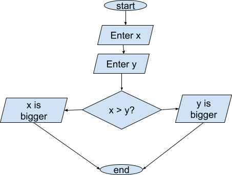

# Chapter 3 - Control Structures

Up until now, program flow has moved sequentially from the first line to the last. We declare variables, we ask for input, we perform calculations, we output results, then we stop. In order to make useful programs, we need to add two things. The first is to have control structures that allow us to selectively execute some lines but not others. This chapter discusses selective execution. The second is the ability to repeat sections of code. We will cover that in Chapter 4.

## 3.1 Introduction to Control Structures

### 3.1.1 Selective Execution

So far, sequential execution has been our only option. Consider the following program.

```cpp
int main()
{
    int x = 0;
    int y = 0;
    cout << "Enter an integer: ";
    cin >> x;
    cout << "Enter another integer: ";
    cin >> y;
    cout << x << '\t' << y << endl;
    // '\t' prints out a tab character
    return 0
}
```

Program execution starts at int main, then progresses line by line until the return 0. We could do calculations based on x and y, but not much else. What if we wanted to print out which number was larger? We have no way yet to determine this, and no mechanism to execute the proper print statement.

We need a way to selectively execute some statements, but not others.

Here is an algorithm to print out which of the two numbers is larger.

1. `Ask the user to enter values for x and y`
2. `if x > y then`  
   &emsp;a\. `print "x is larger"`
3. `if y > x then`  
   &emsp;a\. `print "y is larger"`

in this algorithm, either 2a or 3a will execute, but not both.

It is worth asking if either 2a or 3a will ALWAYS execute. In other words, have we covered all the possibilities? Turns out we have not. The numbers could be equal. We need to account for this possibility as well.

We could also represent this algorithm as a flowchart (see Appendix D for more information).



### 3.1.2 Logical Operators

In order to make comparisons between values, we need to define some relational operators.

| **Operator** | **Name** | **Description** |
| --- | --- | --- |
| == | Equal to | Returns true if the two values are the same |
| != | Not Equal to | Returns true if the two values are not the same |
| > | Greater than | Returns true if the first value is larger than the second |
| < | Less than | Returns true if the first value is smaller than the second |
| >= | Greater than or equal to | Returns true if either the first value is larger or the two values are the same |
| <= | Less than or equal to | Returns true if either the first value is larger or the two values are the same |

In order to create compound relational statements, we also need some logical operators to allow us to string together more than one comparison. There are three logical operators:

| **Operator** | **Name** | **Description** |
| --- | --- | --- |
| && | Logical AND | Returns true if both operands are true |
| \|\| | Logical OR | Returns true if either operand is true |
| ! | Logical NOT | A unary operator, it reverses the Boolean value of the operand. |

## 3.2 Selection Statements

### 3.2.1 The if Statement

Syntax

```cpp
if (condition)        // we don't need a ; since we are starting a block
{
    // code to execute if condition is true
}
```

The condition needs to be a **Boolean expression**, that is an expression using relational and logical operators that returns a true or false.

Let’s revisit our first program of this chapter and finally answer the question of which number is bigger.

We will need three selection structures for the three possible outcomes, x is bigger, y is bigger or they are equal. Here is the first:

```cpp
if (x > y)
{
    cout << "The first number is bigger" << endl;
}
```

The message will only print if the value of x is larger than the value of y. The other two selection structures are similar. Here are all three in the complete program.

```cpp
int main()
{
    int x = 0;
    int y = 0;
    cout << "Enter an integer: ";
    cin >> x;
    cout << "Enter another integer: ";
    cin >> y;
    if (x > y)
    {
        cout << "The first number is bigger" << endl;
    }
    if (x < y)
    {
        cout << "The second number is bigger" << endl;
    }
    if (x == y)
    {
        cout << "The numbers are equal" << endl;
    }
    return 0
}
```

We can use logical operators to make compound selection statements. We can modify the program above to print out whether both numbers are positive or both are negative. We can use the logical and (&&) to determine if both values are positive.

```cpp
if (x > 0 && y > 0)
{
    cout << "Both numbers are positive" << endl;
}
```

The message prints only if x>0 is true AND y>0 is true.

Here is the complete program:

```cpp
int main()
{
    int x = 0;
    int y = 0;
    cout << "Enter an integer: ";
    cin >> x;
    cout << "Enter another integer: ";
    cin >> y;
    if (x > 0 && y>0)
    {
        cout << "Both numbers are positive" << endl;
    }
    if (x < 0 && y<0)
    {
        cout << "Both numbers are negative" << endl;
    }
    return 0
}
```

Note: this program does not always produce output. If we have one positive and one negative, nothing will print. We will be able to fix this after the next section.

### 3.2.2 The if-else Statement

The if-else statement allows us to combine multiple conditions into one control structure.

Syntax

```cpp
if (condition 1)
{
 // execute if condition 1 is true
}
else if(condition 2)
{
 // execute if condition 2 is true
}
else if (condition n)
{
 // execute if condition n is true
}
    else
    {
        // execute if no other condition is true
    }
```

We can now fix the issue with the program above where no printout happened if one number was positive and one was negative.

```cpp
int main()
{
    int x = 0;
    int y = 0;
    cout << "Enter an integer: ";
    cin >> x;
    cout << "Enter another integer: ";
    cin >> y;
    if (x > 0 && y>0)
    {
        cout << "Both numbers are positive" << endl;
    }
    else if (x < 0 && y<0)
    {
        cout << "Both numbers are negative" << endl;
    }
    else
    {
        cout << "Numbers are mixed sign" << endl;
    }
    return 0;
}
```

Note: In an if-else structure, only one set of code will ever be executed. If multiple conditions are true, only the first will trigger.

Example:

```cpp
int main()
{
    int x = 5;

    if (x > 0)
    {
        cout << "positive" << endl;
    }
    else if (x > 1)
    {
        cout << "bigger than 1" << endl;
    }
  return 0;
}
```

In this case, both the if and the else if conditions are true. However, only the first one will execute. The program will print out “positive.”

Nested if-else statements

It can be useful to imbed or nest one if-else inside of another. This gives more flexibility in the conditions you can test for. Here is the basic syntax:

```cpp
if (condition1)
{
    if(condition2)
    {
        // executes if both condition1 and condition2 are true
    }
    else(condition3)
    {
        // executes if both condition1 and condition3 are true
    }
}
else
{
    if (condition4)
    {
        // executes if condition1 is false and condition4 is true
    }
}
```

Example program using nested if structures:

```cpp
int main()
   {
     int number;

     cout << "Enter a number: ";
     cin >> number;
    if (number >= 0)
   {
        if (number == 0)
     {
            cout << "The number is zero." << endl;
        }
     else
     {
         cout << "The number is positive." << endl;
     }
    }
   else
   {
         cout << "The number is negative." << endl;
    }
    return 0;
}
```

It is important to note that the inner if-else structure (in bold) is complete. It could exist independently.

Pitfalls to avoid:

- Off by one error - make sure that you are including all valid values in one of your conditions.

| Off by One Verson | Correct Version |
| --- | --- |
| `if (x < 100)`<br>`// do something`<br>`else (x > 100)`<br>`// do something else`<br>`This excludes 100.` | `if (x <= 100)`<br>`// do something`<br>`else (x > 100)`<br>`// do something else`<br>`100 is in if block.` |

- Logical operator contradictions - connected relational operators that can never be true
    - if (x  < 0 && x > 100)   // no number is both less than zero and greater than 100.
- WIth nested loops, make sure that each else is part of the correct if. Remember, spacing in C++ does not matter. It is the placement of curly braces that determines control structure boundaries.

### 3.2.3 The Switch Statement

The **switch** control structure can be used to execute different code sections based on discrete values of a variable. No ranges are permitted. A switch is best used when there are a limited number of options a variable can take. It can replace a series of if-else statements.

Syntax

```cpp
switch (expression)    // must evaluate to an single value
{
    case constant:   // constant must be a literal like a 1 or 'A'
        // code to execute if expression == constant
        break; // necessary to stop execution from continuing
    default:
        // optional
        // code executes if no other cases hold
}
```

Example: Using Switch for a simple menu

```cpp
int main()
   {
     int c = 0;
     cout << "Menu" << endl;
     cout << "1. Say Hi" << endl;
     cout << "2. Say Bye" << endl;
     cout << "3. Say Not Today" << endl;
     cout << "==>";
     cin >> c;
     switch(c)
     {
         case 1:
             cout << "Hi" << endl;
             break;
         case 2:
             cout << "Bye" << endl;
             break;
         case 3:
             cout << "Ahhhhhhhhhhh" << endl;
             break;
         default:
             // if here, no valid choice entered
             cout << " Invalid Choice" << endl;
    } // end switch
```

We could have done the same thing with an if-else. For discrete values, though, a switch statement can be easier to code. It also produces code that is easier for someone else to read.

Just as in if-else structures, only one case will be selected. Even if more than one case is true, only the first one to be true will be executed.

Using the **break** is essential. In the above menu example, if we did not include breaks, if the user entered one, all three messages would print out. In some programs, this can be used to our advantage, but is generally not what we want.

Here is an example of code that exploits this behavior:

```cpp
int main()
{
    int day;
    cout << "Enter the day of the week (1 = Monday, 2 = Tuesday, ..., 7 = Sunday): ";
        cin >> day;
    cout << "The remaining days of the week are:" << endl;

    switch (day)
    {
        case 1: // Fall-through starts here
        cout << "Monday" << endl;
        case 2:
        cout << "Tuesday" << endl;
        case 3:
        cout << "Wednesday" << endl;
        case 4:
        cout << "Thursday" << endl;
        case 5:
        cout << "Friday" << endl;
        case 6:
        cout << "Saturday" << endl;
        case 7:
        cout << "Sunday" << endl;
        break; // Exit after Sunday
        default:
        cout << "Invalid day! Enter a number between 1 and 7." << endl;
            } // end switch
    return 0;
    }
```

If the user enters 4, for example, the program will print “Thursday”, then fall through to the next case to print “Friday”, then fall through again to print “Saturday” and then “Sunday”.

## 3.3 Debugging Control Structures

With the introduction of selective execution, the complexity of our programs has increased. Therefore, they will be more difficult to debug when a problem occurs.

One way to trace the flow of your program is with print (cout) statements. You can display messages as program control hits specific places, such as inside of a loop. You can also use print statements to track the value of variables at certain locations in the code.

## 3.4 Best Practices for Writing Control Structures

Take the time to make your code as easy to read as possible. This includes using spaces and indentation to mimic program structure. It also includes limiting nesting. You can also add comments to give clues as to what the code is doing.

Example: Clear spacing

```cpp
if(x > 100)
  {
     if(y > 100)
     {
         cout << "Both greater than 100);
     }
  }
```

Example: Unclear spacing

```cpp
if(x>100){if(y>100){cout<<"Both greater than 100";}}
```

The unclear spacing still works, but is much harder to see what is going on.
