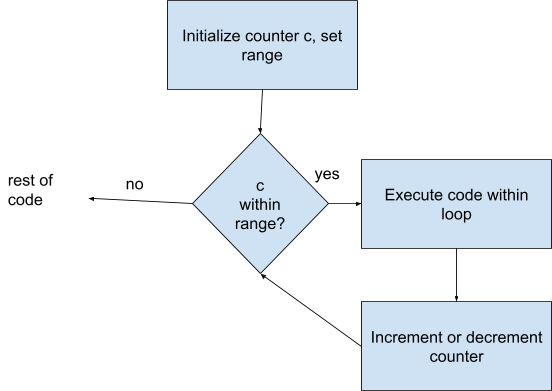
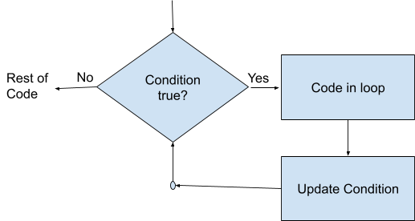

# Chapter 4 - Repetition - Iterative Control Structures

## 4.1 Introduction to Iterative Control Structures

Iterative Control Structures, more commonly known as Loops, are used to repeat sections of code. It is the ability to repeat code that really gives programs their power.

## 4.2 Types of Loops in C++

We have three options for loops in C++:

- **for** loops - also known as counting loops. For loops will execute for a predetermined number of times. For loops are used when you know how many times you want a loop to repeat.
- **while** loops - a conditional loop, code only executes if a logical condition is true at the beginning of each iteration. There is no guarantee that the code within the loop will ever execute.
- **do-while** loops - another conditional loop that tests a condition at the end of the loop. A do-while loop is guaranteed to execute at least once.

Both types of conditional loop have the possibility of developing **infinite loops**, where there is no way for the condition the loop is based on to become false.

## 4.3 The for Loop

A for loop uses a counter to move through the loop. The for statement need to include where the counter starts and stops and how it is incremented or decremented each trip through the loop.

**Syntax**

```cpp
for (counter initialization; condition to continue; increment/decrement counter)
{
 // Code to execute on each iteration
}
```

**Flowchart**



Initialization of counter

In this first part of the for statement, we have to set an initial value for an int variable that will serve as our counter. This could be an already existing variable, but it is more common to declare the variable in the for statement. When declared within the for loop, the counter is only in score (able to be used) while the in the loop. This reduces the chance that a counter from some other loop could affect the current look. Everytime you execute the loop, you get a new counter. The following example will create a int variable c and give it the value 0.

```cpp
for(int c = 0;
```

Condition to continue

The second part of the for statement gives the condition that must be true in order for the code inside the loop to execute. The following example will keep executing the loop code as long as the value of c is less than 100:

```cpp
for(int c = 0; c < 100;
```

Increment/Decrement counter

The last part of the for statement either increases or decreases the counter. We commonly use the ++ and -- unary operators for this. The following example increases the counter by 1 on each execution.

```cpp
for(int c=0; c <100; c++)
```

Code within the above for loop will execute 100 times, with x taking on values from 0 to 1 to 2 to ... 99.

Example - Counting from 1 to 5.

```cpp
for(int c=1; c<=5; c++)
{
    cout << c << endl;
}
```

The cout line will execute 5 times, with values of c being 1, then 2, then 3, then 4, then 5. Program flow will then move to the next line after the last curly bracket.

Example - Counting down from 10 to 0:

```cpp
for (int i=10; i >=0; i--)
{
    cout << i << endl;
}
```

Common pitfalls with for loops

- Getting the initialization or the condition wrong and being off by 1
- Trying to use the counter variable when outside the loop.

## 4.4 The while Loop

**Syntax**

```cpp
while (condition is true)
{
    // code to execute while condition is true
    // there has to be a way to move towards terminal condition
}
```



While loops are used when you don’t know how many times the loop needs to execute. It could be that it never executes. It all depends on the condition. This condition is often called a **Sentinel** condition, as it guards the loop.

Example, taking numbers from a user until they enter a 0, then calculating a sum. Note that unlike with a for loop, we need to set up the variables for the condition before we get to the loop.

```cpp
int n = 10;
int sum = 0; // must be outside loop
while(n != 0)
{
    cout << "Enter a number (0 to end): ";
    cin >> n;
    sum = sum + n;

}
```

Since we are asking for n on each trip through the loop, we do not have an infinite loop. We just used a dummy value for n before the loop that was intended to get us in the loop where we would immediately ask for a different value. It is also possible, and sometimes preferable, to ask the user for a value before entering the loop. If we choose to do that, our code would look like:

```cpp
int n;
int sum = 0; // must be outside loop
cout << "Enter a number (0 to end): ";
cin >> n;
while(n != 0)
{
    sum = sum + n;
    cout << "Enter a number (0 to end): ";
    cin >> n;

 }
```

It is common to use flags with conditional loops. Flags are Boolean variables that answer yes/no questions. In the Example below, we use a Boolean variable called cont to see if the user wants to loop again.

```cpp
bool cont = true;
char choice;        // to hold user choice
while(cont)
{
    // do something
    cout << "Do you want to continue (Y/N)?: ";
    cin >> c;
    if (c == 'y' || c == 'Y')
    {
        cont = true;
    } else {
        cont = false;
    }
}
```

## 4.5 The do-while Loop

**Syntax:**

```cpp
do
{
    // code to execute
    // there has to be a way to move towards terminal condition
} while (continuing condition)
```

Like **while**, the **do-while** loop is a conditional loop. The only difference is that the test is at the end. A **do-while** loop is guaranteed to execute at least once.

As in the while loop, infinite loops are possible if there is no way to reach the terminal condition.

In practice, I rarely use **do-while** loops. There is one case where they come in handy, and that is for validating user input. Recall in Chapter 2, we allowed the user to use **cin** to input integers, but we did not check to make sure they actually entered one correctly.  We can fix that with a **do-while** loop. We will also use the following attributes of **cin**:

- **cin.fail()** - will return true if the user entered an incorrect value
- **cin.clear()** - clear the error message
- **cin.ignore(1000, ‘\\n’)** - ignore the invalid input in the cin buffer

Here is an example:

```cpp
#include <iostream>
using namespace std;
int main()
{
    int number;
    do
    {
        cout << "Enter an integer between 1 and 100: ";
        cin >> number;
        // If input is invalid - cin.fail() will be false
        if (cin.fail())
        {
            cout << "Invalid input. Try again." << endl;
            cin.clear();              // Clear the error flag
            cin.ignore(1000, '\n');   // Ignore invalid data
            }
        else if (number < 1 || number > 100)
        {
            cout << "Number out of range! Try again." << endl;
        }
    // loop again if cin.fail or number out of range
        } while (cin.fail() || number < 1 || number > 100);
    cout << "You entered a valid number: " << number << endl;
    return 0;
}
```

You should always verify user input.

## 4.6 Control Flow Modifiers

There are two commands that we can use to alter the normal flow of a loop.

**break** - causes immediate termination of the loop. Here is an example program where the user enters as many positive ints as wanted. A negative number halts entry of numbers.

```cpp
int n = 0;
while(true)
{
    cout << "Enter a positive integer (negative to exit): ";
    cin >> n;
    if (n < 0)
    {
        break;
    }
    cout << "You entered " << n << endl;
}
```

Note the use of **while(true)**. This loop continues until a break is encountered.

**continue -** skip the rest of the loop for the current iteration.

We can use this to ignore certain values. Here is an example program that asks the users to enter positive ints to be added together. Any negative values should be ignored. Entering a -99 will terminate the loop.

```cpp
#include <iostream>
using namespace std;

int main()
{
  int n ;
  int sum = 0;
  while(n != -99)
    {
      cout << "Enter a positive integer (-99 to exit): ";
      cin >> n;
      if (n < 0)
        {
          cout << "Skip negative numbers" << endl;
          continue;
        }
      sum = sum + n; // will not execute on negative numbers
    }
  cout << "Sum is " << sum << endl;

  return 0;
}
```

## 4.7 Nested Loops

Loops can be nested, so that one is inside of another. Care must be taken to ensure that both loops are proceeding properly and that both will eventually terminate.

For our first example, we will use two **for loops** to calculate the multiplication table from 1 to 5.

Here is the code:

```cpp
#include <iostream>
using namespace std;

int main()
{
  cout << "Multiplication table 1 - 5" << endl;

  for (int x=1; x<=5; x++)  //outer loop
    {
      for(int y=1; y<=5; y++)   // inner loop
        {
          cout << x*y << '\t';  // tab between y values
        }
      cout << endl;  // new line between x values
    }

  return 0;
}
```

Note that for each value of x, all values of y are processed before moving to the next x.

The next example uses a **while loop** to ask the user if they want to repeat, then a **for loop** to determine the factors from 1 to 10. There is a tab between numbers and a new line at the end. Note, for space considerations I am not testing user input.

```cpp
// declare variables
int n;
char choice = 'Y';  // get into loop the first time

cout << "Factors through 10" << endl;

// Outer loop - if user wants to do again
while (choice == 'Y' || choice == 'y')
  {
    // ask for number - no verification
    cout << "Enter an integer: ";
    cin >> n;

    // loop to print factors
    for (int i=1; i<=10;i++)
      {
        cout << n*i << '\t';
      }

    cout << endl;

    // ask to repeat
    cout << "Do you want to do again?(Y or N): ";
    cin >> choice;
  }
```

You can nest **for**, **while**, and **do-while** loops in any order. You can also nest as many levels as you need, keeping in mind that more levels make the code harder to read.

## 4.8 Common Pitfalls and Debugging Tips

• Infinite loops: occur when there is no way to reach a terminal condition in a loop.

• Off-by-one errors in iteration.

• Debugging techniques for loops: test loops with simple print statements before adding more complex code. If the loops are wrong, the program cannot be correct..
