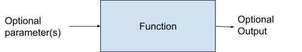
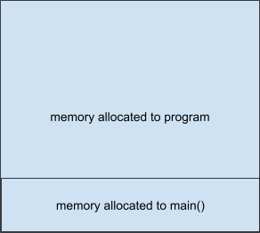
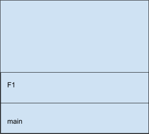
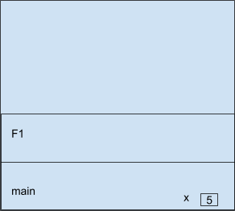
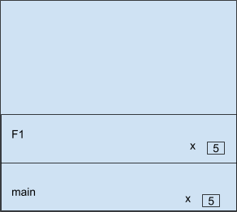

<!-- nav -->
[Table of contents](https://def3qu.github.io/Concise-CPP-Book/) | [Next: Chapter 6 →](06-arrays.md)

# Chapter 5 - Functions

## 5.1 Introduction to Functions

Like several topics we will discuss, functions in C++ are not like functions in Mathematics. Luckily, however, they are similar in concept to Python functions, although the syntax is different.

Functions are a self-contained block of code that is written to perform a specific task. Functions are created to break up programs into logical units. They also serve to make programs easier to read and easier to modify.

Functions can take input called parameters, and can return output. We can think of functions as black boxes. We send in parameters and get results.



Functions can take many parameters, or none at all. Functions can return one item or not any at all. Some functions are built-in to C++, while others are created by the programmer.

## 5.2 Using Built-in Functions

We have already been using some built-in functions, **cin**, **cout** and **endl** are all functions. Those 3 are found in the <**iostream**> library. There are many other functions we can use, often found in libraries that must be included to use them in our code. The math library in C++ is called <**cmath>**. It contains many useful functions that we will discuss throughout the rest of the book. As an example, we will use the **pow** function to do exponentiation (raising a number to a power.) To use this function, we need to add the following line to the top of our program.

```cpp
#include <cmath>
```

The **pow** function itself takes two parameters, a base and an exponent, and returns the base raised to the exponent power.  The return value will need to be printed or saved to a variable. The base and the exponent can be any combination of ints, floats or doubles. The results will be a double, but could be implicitly cast to an int. Here is how we could use the **pow** function:

```cpp
int n = pow(5, 2);
cout << n << endl;
// Output would be 25
```

**Common Mathematical Functions**

| **Name** | **Output** |
| --- | --- |
| abs(x) - Absolute Value | Absolute value of x |
| pow(b, e) - Exponentiation | b raised to the power of e |
| sqrt(x) - Square Root | Square root of x |
| log(x) - Natural Log | Natural Log of x |
| log10(x) - Logarithm base 10 | Log base 10 of x |
| sin(x)  - sine | Sin of x |
| cos(x) - cosine | Cosine of x |
| tan(x) - tangent | Tangent of x |

Other useful functions can be found in the <**string**> library.

| **Name** | **Output** |
| --- | --- |
| length()/size() | Returns the length of a string<br>`cout << s.length() << endl;` |
| substr(pos, len) | Extracts substring starting a pos with length len |
| find(str) | Finds the first instance of str in string |

There are many other libraries, some of which we will cover later in the book

## 5.3 Creating a Function

General Syntax

```cpp
returnType functionName(parameters)
{
        // function body
}
```

Return type is either void(if nothing is returned) or the data type that will be returned. The function name follows normal naming conventions for variables. The parameters are typed input values that we are sending to the function.

The return type along with the type and number of parameters is known as the function’s signature.

The function body defines what the function does. Note, a function cannot access any variables from another function (like main()) unless it is passed as a parameter.

### 5.3.1 Void functions

Functions that do not return a value are called **void functions**. The return type of a void function is the keyword void. Since they do not return anything, void functions are used to perform an action or to display information.

Here is an example of a void function that prints out a simple menu:

```cpp
void printMenu()
{
    cout << "\t1. Do something" << endl;
    cout << "\t2. Do something else" << endl;
    cout << "\t3. Exit" << endl;
```

}

When this function is called, the menu is displayed on the screen, and control is returned to the calling function. A **return** statement is not necessary since it is a void function, but you can include one if you want to exit the function early.

Void functions can take parameters. Here is an example of a function that takes a name and a greeting and displays a custom message.

```cpp
void greeting(string message, string name)
{
    cout << message << " , " << name << "!!!" << endl;
}
```

### 5.3.2 Value Returning Functions

It is common for a function to return a value. Only one item can be returned from a function. If you need to return more than one thing, keep reading. We will address that in future chapters.

Let’s create a function that takes two Integers and returns the modulus or remainder when you divide the first by the second. The remainder will be an integer, so the return type of our function has to be **`int`**. The function takes two parameters that are both integers.

```cpp
int remainder(int x, int y)
{
    return x%y;
}
```

Functions can be simple with only a single line, or complex with dozens of lines.

## 5.4 Calling Functions

### 5.4.1 How to call a function from main() or other functions.

In order to call a function somewhere in your code, the compiler has to know about it. This means that the code of the function, or at least a bit of it, has to be in your program before you call it. Here is a simple example with a void function that only displays hello.

```cpp
int main()
{
  hello();
  return 0;
}
void hello()
{
  cout << "Hello" << endl;
}
```

When you run this, you get the following:

```cpp
error: 'hello' was not declared in this scope;
```

To fix this, you need to declare the function first. This code works without errors:

```cpp
void hello()
{
  cout << "Hello" << endl;
}
int main()
{
  hello();
  return 0;
}
```

If the function takes parameters, it is essential that you pass along the correct number and the correct type of values.  If we are call the remainder() function as follows:

```cpp
remainder(4, 3, 7)
```

The program will not compile. Instead we will get a “Too many arguments to function” error.

### 5.4.2 Passing Values to Functions

In order to understand how to pass arguments to a function, we need to talk about where the program exists in memory. Remember, in C++, we can directly interact with the memory. When we run a program, the Operating System (Ubuntu Linux in our case) will reserve a contiguous memory block to run the program. How much memory it gets varies widely, and is beyond the scope of this book. In C++, each program will have a main() function, so it gets placed in a portion of the block reserved for the program.



All of the variables we define in main() are stored in its block of memory. Note that main() does not take up all of the memory for the program. When we call another function, say F1  that function is loaded into a different memory block.



If we define a variable in main(), such as an Integer x that is equal to 5, then x is stored in main’s memory block. If the program control is moved to F1, F1 cannot access x, and will return an error.



Example of the scope error:

```cpp
int F1()
{
    return x * x;
}
int main()
{
    int x = 5;
    cout << F1() << endl;
    return 0;
}
```

When we try to compile, we get an error that ‘x’ was not declared in this scope. To pass the 5 to F1, we have to include it as a parameter. That way the value of x, 5, is passed along to F1, and a variable is reserved in F1 to hold that value. It will be named whatever is listed in the function’s definition. So if we rewrite out code as follows:

```cpp
int F1(int x)
{
    return x * x;
}
int main()
{
    int x = 5;
    cout << F1() << endl;
    return 0;
}
```

The code compiles with no errors. Let's take a look at what the memory looks like while F1 is operating, i.e. before the return.



Now both F1 and main have a version of the int x. There is a consequence to this. If F1 changes the value of its x, it will not have any impact on main’s x. Here is an example:

```cpp
int F1(int x)
{
    int s   = x * x;
    x = 100;
    return s;
}
int main()
{
    int x = 5;
    cout << F1() << " " << x << endl;
    return 0;
}
```

Even though we are changing the value of x in F1, when we print out x along with the return value from F!, x will still have the value of 5. Sending a variable to a function this wayl is called Pass by Value. No matter what happens to variables that are Passed By Value, they can have no side effects on the calling function.

### 5.4.3 Passing References to Variables to a Function

Remember, variables are really labels for memory addresses. When we initialize a variable with a type, the Operating System creates a box in the memory space assigned to the function that creates the variable. The variable now has two aspects. The first is the address where the variable is stored. This changes each time you run the program, but you can access it by using a & before the variable name. The second is the value that is stored at that memory address. We just use the variable name to get to that.

Here is an example:

```cpp
int main()
{
    int x = 5;
    cout << "x holds the value " << x << endl;
    cout << "x is located at " << &x << endl;
    return 0;
}
```

Output of the program:

```text
x holds the value 5
x is located at 0x7ffe435fa5a4
```

Run it again and you get:

```text
x holds the value 5
x is located at 0x7ffdad36b864
```

So the memory address changes each time we run the program.

When we pass a variable name to a function, we are passing along the value that the variable holds. The function then initializes a variable in its own memory block to store the value.

If we want the function to be able to make changes to the variable that are reflected back in the calling program, we need to pass the reference to where the variable is stored. Then, the function can write any changes to the memory address of the original variable. This is called Passing by Reference.

Example Program:

```cpp
void F1(int &x)
{
    // x passed by reference, so changes are persistent
    x = 100;
}
int main()
{
    int x = 5;
    cout << "x holds the value " << x << endl;
    F1(x);
    cout << "x holds the value " << x << endl;
  return 0;
}
```

The output of this is:

```text
x holds the value 5
x holds the value 100
```

### 5.4.4 Returning More than One Item With Pass By Reference

You can use Pass by Reference to, in essence, return more than one value from a function. Let’s say you want to create a function that asks the user for two numbers, and then returns both to the calling function. Please note that this is almost never a sound idea. We are doing it to show a point. We can make our function a void function, and then pass it two variables by reference.

```cpp
void F1(int &x, int &y)
{
    cout << "Enter Two Integers separated by a Space: ";
    cin >> x >> y;
}
int main()
{
    int x,y;
    F1(x, y);
    cout << "x holds the value " << x << endl;
    cout << "y holds the value " << y << endl;
    return 0;
}
```

Displays the following output:

```text
Enter Two Integers separated by a Space: 3 4
x holds the value 3
y holds the value 4
```

## 5.5 Function Prototypes

Up until now, we have had to define the functions at the top of the programs to make sure that they are available when we call them. This is often inconvenient, as it makes someone viewing the code do a lot of scrolling to get to the main function. A better approach is to use **Function Prototypes**.

A Function Prototype is the Function’s Signature followed by a semicolon. It can be placed at the start of the program, and takes up less room than the full function. The full function can then be defined below **main()**. Let’s use function prototypes to reorganize the Pass By Reference Program above.

```cpp
// Function Prototypes
void F1(int &x, int &y);
int main()
{
    int x,y;
    F1(x, y);
    cout << "x holds the value " << x << endl;
    cout << "y holds the value " << y << endl;
    return 0;
}
// Functions
void F1(int &x, int &y)
{
    cout << "Enter Two Integers separated by a Space: ";
    cin >> x >> y;
}
```

Note that you don’t have to include the variable names in the Function Prototype. We could have written:

```cpp
void F1(int &, int &);
```

## 5.6 Scope and Lifetime

Functions come to life when they are called. They go away and release their memory when a **return** statement is encountered.

Scope refers to whether a variable or function is visible and accessible. If declared within a function, variables have scope only in that function. If you want a variable to have global scope, i,e, visible from all parts of a program, it needs to be declared outside of any function. Let’s modify our Pass by Reference Program again.

```cpp
// Global Variables
string name = "Bob"

 // Function Prototypes
void F1(int &x, int &y);

int main()
{
    int x,y;
    F1(x, y);
    cout << "x holds the value " << x << endl;
    cout << "y holds the value " << y << endl;
    cout << name << endl;  // name has scope here
    return 0;
}
// Functions
void F1(int &x, int &y)
{
    cout << "Enter Two Integers separated by a Space: ";
    cin >> x >> y;
    cout << name << endl;  // name has scope here as well
}
```

## 5.7 Default Arguments

You can assign default values to the parameters that are sent to a function. These default parameters are set in the function signature, and will be used if the function call does not include the parameter. Here is a simple example:

```cpp
void F1(int age = 25, string name="Bob")
{
    cout << name << " is " << age << endl;
}

int main()
{
    F1();
    F1(35);
    F1(45, "Alice");

    return 0;
}
```

This gives the following output:

```text
Bob is 25       // No parameters are given so the defaults are used
Bob is 35       // Age is sent, but the default is used for name
Alice is 45     // Both age and name are sent and used
```

There are some restrictions on the use of default parameters.

- You could not call F1 with only a name. You can only leave off parameters from the right.
- Once a parameter is given a default value, all parameters to the right have to have default values as well

## 5.8 Function Overloading

We can create more than one function with the same name, as long as the functions differ in the number and type of parameters in the function signature.

For example, we could create a display function to show the value of a variable. Let’s create one for ints.

```cpp
void display(int x)
{
    cout << "The variable has the value: " << x << endl;
}
```

If we send display a double, it will not give an error, but will instead do an implicit typecast to an int and not display any decimal portions of the variable. To fix this, we can make a separate function. We could give it a different name, or we could just overload the display function as follows:

```cpp
void display(double x)
{
    cout << "The variable has the value: " << x << endl;
}
```

Now the decimal portion will display correctly.

## 5.9 Recursion

Recursion is when a function calls itself.  Some problems can be solved efficiently using recursion because it allows you to break down a complex problem into simpler versions of itself.

Let's work through an example to see how this works.

The **factorial** of a number  (denoted ) is defined as

In order to be able to write a recursive function, we have to be able to define the problem in terms of prior versions of itself. So, for example:

...so we can rewrite  as

### 5.9.1 Creating a Recursive Function

We can now work on a recursive function **fact()**. If **fact()** takes 6 as its input parameter, it will calculate  by multiplying 6 by **fact(5)**. This will create a new copy of the function that will calculate  by multiplying 5 by **fact(4)**. And so on.

When does this end? The one value where we can return a definitive answer for a factorial is 1. . We call this the **base case**. It is the case or cases where we can return an answer directly without having to call the function recursively. If your recursive function does not have a base case, it will keep calling itself until you press ctrl-c, or the computer runs out of memory.

Here is the code for the **fact()** function.

```cpp
int fact(int n)
{
  if (n==1)
    {
      return 1;
    }
  else
    {
      return n * fact(n-1);
    }
}
```

Note: you need to make sure that only positive integers are sent to the function.

Now, let's step through how  will be calculated..

```text
Call 1  fact(6)         Return 6 x fact(5)              wait on call 2
Call 2          fact(5)         Return 5 x fact(4)              wait on call 3
Call 3  fact(4)         Return 4 x fact(3)              wait on call 4
Call 4  fact(3)         Return 3 x fact(2)              wait on call 5
Call 5  fact(2)         Return 2 x fact(1)              wait on call 6
Call 6  fact(1)         Base case, so return 1 to call 5        ends

Call 5  receives the 1 from Call 6              return 2x1=2 to call 4          ends
Call 4  receives the 2 from Call 5              return 3x2=6 to call 3          ends
Call 3          receives the 6 from Call 4              return 4x6-24 to call 2         ends
Call 2  receives the 12 from Call 3     return 5x24 =120 to call 1      ends
Call 1  receives the 60 from Call 2     return 6x120=720 to main()      ends

main() receives 720, which is the correct answer for 6!
```

How do we go about coding this? The key is that every recursive function needs to check to see if the parameter sent in is a base case. If so, it returns an answer and recursion stops. If not, it makes a recursive call.

### 5.9.1 Limitations of Recursive Functions

There are some drawbacks to using recursive functions.

1. They can be difficult to understand. The code is often shorter and more terse than an iterative function that does the same thing
2. Recursive functions use more memory. With each recursive call, the calling function stops and a new function instance has to be created in memory. This can add up if the recursion is deep.
3. Recursive functions can be **less efficient** than iterative versions due to overhead involved with function calls and memory management.

### 5.9.2 Tail Recursion

If the recursive call is the last operation in the function, the compiler can sometimes optimize it into an iterative process. However, this optimization is not always guaranteed in C++.

## 5.10 Best Practices

Here are some guidelines to follow when creating functions:

- A major goal of functions is reusability. Keep that in mind when developing them.
- A function should do one thing well. Overly complicated functions cannot be reused easily
- Have a consistent naming scheme for functions to make them easy to remember
- Don’t print within a function unless you only print in a function
    - Example: If you create a function to convert Fahrenheit to Celcius, it is better to return the Celcius value to the calling program rather than print it in the function. This will be more generally useful for other parts of your program.
- Make sure that you have appropriate comments in your function

---

[← Previous: Chapter 4](04-repetition.md) | [Table of contents](https://def3qu.github.io/Concise-CPP-Book/) | [Next: Chapter 6 →](06-arrays.md)
