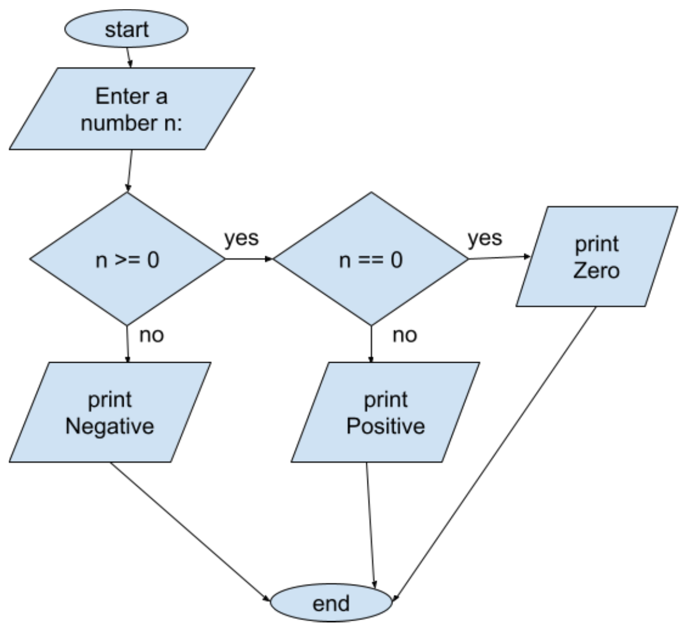

<!-- nav -->
[Table of contents](https://def3qu.github.io/Concise-CPP-Book/) | [Next: Appendix E →](appendix-e-ascii-table.md)

# Appendix D - Flowcharts

Flowcharts can be useful for specifying program flow. We can use them to model program flow. Here are the basic components of a flowchart

## Basic Symbols in Flowcharts

## Steps to Create a Flowchart

1. **Identify the Problem**
2. **Break the Problem into Steps**
3. **Choose Symbols**
4. **Connect the Symbols**
5. **Verify the Flowchart**

## Flowchart Example

Create an algorithm to allow a user to enter a number, then decide whether it is positive, negative or zero.

---

[← Previous: Appendix C](appendix-c-useful-emacs-commands.md) | [Table of contents](https://def3qu.github.io/Concise-CPP-Book/) | [Next: Appendix E →](appendix-e-ascii-table.md)
